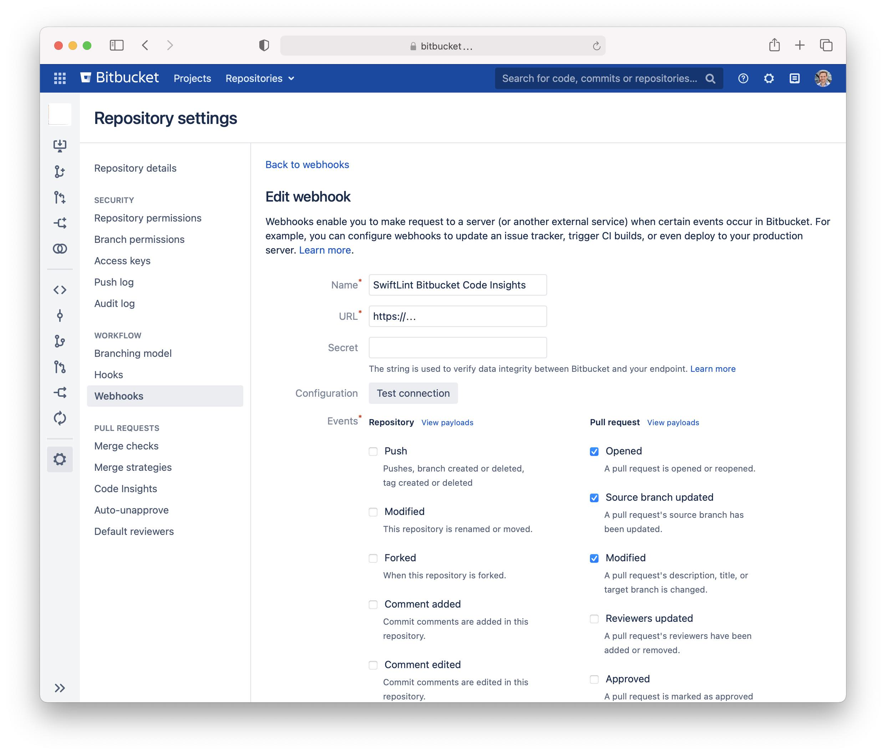

# SwiftLint Bitbucket Code Insights

This repository contains a small web service that can respond to [BitBucket WebHooks](https://support.atlassian.com/bitbucket-cloud/docs/manage-webhooks/) to trigger [SwiftLint](https://github.com/realm/SwiftLint) and report the result to a BitBucket server instance using BitBucket [Code Insights](https://confluence.atlassian.com/bitbucketserver/code-insights-966660485.html).

## Deployment

You can deploy the SwiftLint Bitbucket Code Insights web service using [Docker](https://www.docker.com) using the `docker-compose.yml` or the `Dockerfile` in the repository.
Once you have deployed the web service, you will configure repositories to send out webhook events to trigger the workflow on the web service.

## Configuration

1. Navigate to your repository settings in the Bitbucket server and select the **Webhooks** section.
2. Select **Create webhook** and add the following information:
 - Name: A descriptive name, e.g.: *SwiftLint Bitbucket Code Insights*
 - URL: The URL you have deployed the SwiftLint Bitbucket Code Insights web service to. 
 - Secret: Can be left empty.
 - Select the following events: 
  - *Opened*: A pull request is opened or reopened.
  - *Source branch updated*: A pull request's source branch has been updated.
  - *Modified*: A pull request's description, title, or target branch is changed.
3. Make sure that the webhook is set to active at the bottom of the page and press **Create**.

Future pull requests will trigger the webhook, and the web service will review the pull requests and provide an insights report and annotations in the code diff.

*Optional*: You can optionally configure Bitbucket to block pull requests from being merged until the code insights reports of the SwiftLint Bitbucket Code Insights is marked as passing. You can configure this in the **Code Insights** section of the settings of your Bitbucket repository. I suggest the *Required status* to be *Must Pass* and the *Annotation requirements* to be *Must not have medium or high severity annotations*.

## Contributing
Contributions to this project are welcome.

## License
This project is licensed under the MIT License. See [License](LICENSE) for more information.
